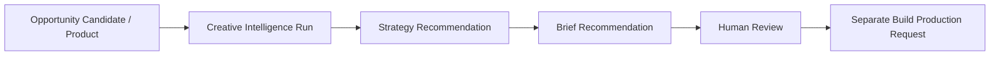

# AI Creative Intelligence Foundation v1.0

Status: Frozen for Sprint 046

## Invariant and ownership

**AI CREATIVE INTELLIGENCE ≠ CREATIVE EXECUTION AUTHORITY.** Decision owns strategy, messaging, audience, angle, and brief recommendations. Build retains production requests, artifacts, asset versions, and generation workflow. Growth owns distribution, Governance owns approval, and Finance owns economic truth.

The workflow never creates a production request, asset, generation job, approval, campaign, publication, spend, Product Truth change, or external call.

## Lifecycle and grounding

`CreativeIntelligenceRun` is tenant-scoped and audited. It references an opportunity candidate or product, registered AI capability, optional prompt version, and canonical request. Lifecycle is `draft → queued → running → completed`, with `running → failed` and `draft/queued → cancelled`; terminal states cannot reopen.

Every run requires references to existing customer language, pain clusters, or customer needs. Evidence records contain source IDs, safe references, and supplied confidence rather than copied truth. Strategy confidence is the deterministic mean of referenced evidence confidence. No customer claim may be invented.

## Advisory outputs

Four templates cover pain, transformation, trust, and education messaging. Structured AI output requires customer, problem, hook, message, creative angle, visual direction, proof points, and risks. Malformed output fails safely through the Sprint 043 schema boundary.

`CreativeStrategyRecommendation` records target customer, problem, messages, emotional/rational angles, proof, objections, channels, evidence-derived confidence, risks, and optional estimated impact. Estimated impact is advisory; Finance remains authoritative.

`CreativeAngle` is a reusable, evidence-linked recommendation with source and confidence. `CreativeBriefRecommendation` contains the proposed hook, problem, solution, proof, CTA, visual/video/image/UGC directions, audience, channel, and evidence references. Supported channels are TikTok, Instagram, Facebook, Pinterest, and YouTube Shorts.

These recommendations are distinct from existing Decision `CreativeStrategy`/`CreativeBrief` records and Build `CreativeProductionRequest`: a separate governed human workflow must convert advice into those records.

## Runtime, API, and security

The existing worker uses an explicit service identity to submit reference-only context through the Sprint 043 governed runtime and deterministic CI adapter. Direct providers, approval authority, production execution, and publishing are forbidden.

Authenticated APIs create, list, inspect, queue, and cancel runs and list strategy/brief recommendations. Universal authentication, RBAC, tenant isolation, audit logging, provider secret isolation, cost/rate gates, and output authority restrictions apply.
