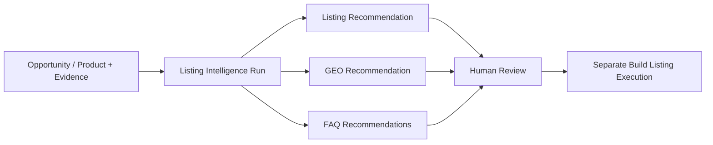

# AI Listing and GEO Content Intelligence Foundation v1.0

Status: Frozen for Sprint 047

## Invariant and ownership

**AI LISTING INTELLIGENCE ≠ PRODUCT TRUTH.** Decision owns listing, GEO, and FAQ recommendations. Build retains Product Truth and published product content. Growth owns distribution, Governance owns approvals, and Finance owns economic truth.

No recommendation may modify Product Truth, create Build listing records, approve claims, publish, distribute, spend, or execute an external action.

## Lifecycle and grounding

`ListingIntelligenceRun` is tenant-scoped and audited. It references a product or opportunity candidate, a registered AI capability, an optional governed prompt version, and the canonical AI request. Lifecycle is `draft → queued → running → completed`, with `running → failed` and `draft/queued → cancelled`; terminal states never reopen.

Every run requires existing customer-language, pain-cluster, customer-need, marketplace-review, or research-analysis references. Evidence payloads are not copied. Recommendation confidence is the deterministic mean of supplied evidence confidence, and missing information is explicit.

## Recommendations

`ListingStrategyRecommendation` contains customer segment, problem, positioning, unique value, benefits, feature translation, trust elements, objections, competitive difference, evidence-derived confidence, and exact source references.

`GEOContentRecommendation` contains entity description, important attributes, customer questions, answer strategy, comparison/expert topics, citation targets, missing information, and confidence. It is a strategy recommendation, not a canonical `GeoKnowledgeAsset`.

Each `FAQRecommendation` stores a question, customer intent, answer outline, evidence references, and risk. Shipping, quality, comparison, usage, and safety are supported as advisory intent labels; answers require human verification against Product Truth and policy before Build use.

## Existing-contract separation

Sprint 047 does not replace Decision `ListingBlueprint` or `GeoKnowledgeAsset`, nor Build `ListingStrategy`, `ProductDiscoveryKnowledge`, `ContentBrief`, or `ListingEvidence`. A separate governed workflow must convert reviewed advice into Build-owned content.

## Runtime, API, and security

The existing worker sends reference-only evidence through the Sprint 043 governed runtime using an explicit service identity. Structured validation rejects incomplete output; the deterministic adapter keeps CI credential-free. Direct provider calls and publishing are forbidden.

Authenticated APIs manage run creation and lifecycle and list listing, GEO, and FAQ recommendations. Universal authentication, RBAC, tenant isolation, audit logging, provider secret isolation, rate/cost gates, and authority restrictions apply.
