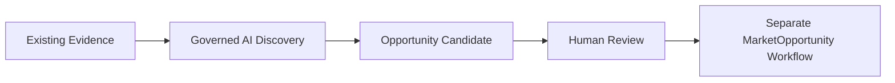

# AI Opportunity Discovery Foundation v1.0

Status: Frozen for Sprint 045

## Invariant and ownership

**AI DISCOVERY ≠ BUSINESS AUTHORITY.** Intelligence owns discovery runs, reference-only evidence interpretation, candidates, methodology, and confidence. Decision owns evaluation and investment recommendations. Governance owns approval. Build owns Product Truth, Finance owns monetary truth, and Operations owns execution.

Discovery cannot create or approve a `MarketOpportunity`, product, launch, approval, publication, spend, customer contact, or Growth action.

## Lifecycle and templates

`OpportunityDiscoveryRun` is tenant-scoped and audited. Its lifecycle is `draft → queued → running → completed`, with `running → failed` and `draft/queued → cancelled`; terminal states never reopen. It may reference a completed Sprint 044 Research Run and always uses a registered capability and optional governed prompt version.

Four templates cover Reddit pain, marketplace reviews, market trends, and cross-source discovery. Each declares compatible evidence types and uses one provider-neutral structured output schema. A run cannot queue unless its references satisfy its template.

## Evidence grounding and output

Allowed evidence is existing `MarketSignal`, `CustomerPainCandidate`, `CustomerPainCluster`, `MarketplaceReviewEvidence`, `ResearchAnalysis`, and `CustomerNeed` data. `OpportunityDiscoveryEvidence` stores references and confidence, not copied source payloads. The candidate retains the exact references used, customer language, risks, open questions, and explicit missing evidence.

The structured result requires title, problem, customer segment, evidence summary, solution direction, customer language, risks, confidence, open questions, and missing evidence. Sprint 043 schema validation rejects malformed output before candidate creation while preserving request provenance and failure records.

## Scoring and review

No new scoring engine is introduced. `advisory_score` is the normalized discovery confidence (`confidence × 100`) and is explicitly an estimate. Existing deterministic opportunity, risk, customer-backed, and economic assessments remain the authoritative downstream evaluation contracts.

A human may place a draft candidate in the Governance Decision Queue. This changes the candidate to `review` and creates no `ApprovalRequest`. Accepted or rejected candidate states are reserved for an explicit future human workflow; acceptance never creates a `MarketOpportunity` automatically.

## Runtime, worker, API, and security

The existing worker creates the canonical Sprint 043 AI request, sends reference-only context, executes through the governed adapter, validates the output, and composes one candidate. It uses an explicit service identity with no approval authority. Direct provider calls are forbidden.

Authenticated `/api/v1` endpoints create, list, inspect, queue, and cancel runs; list and inspect candidates; list templates; and request human review. Universal authentication, organization scope, RBAC, audit logging, secret isolation, cost/rate gates, and deterministic credential-free CI remain mandatory.
