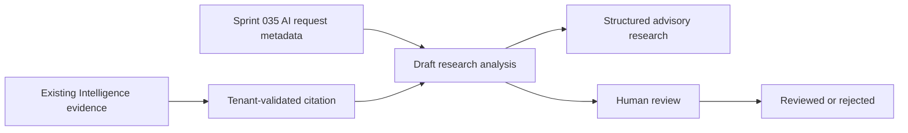

# AI Research Analyst Foundation v1.0

Status: Frozen for Sprint 038

## Ownership

Intelligence owns research analyses, evidence citations, structured customer-pain research, market-insight research, and advisory opportunity briefs. Sprint 035 AI Runtime owns request provenance and capability metadata. Decision continues to own recommendations and opportunity decisions. Governance owns authentication, authorization, audit, approvals, and the human review boundary.

AI analysis is an interpretation layer. It never owns or mutates source evidence, Product Truth, financial truth, customer truth, opportunities, approvals, or execution state.

## Evidence relationship

Every structured research output belongs to an Intelligence analysis and every analysis must cite at least one existing, tenant-scoped evidence record before it may enter human review. Supported evidence includes raw market records, marketplace reviews, normalized marketplace reviews, customer signals, pain clusters, market signals, competitive observations, and opportunity evidence.

Citations record evidence type, immutable identifier, source reference, an explanatory note, and bounded relevance. A citation is provenance, not a copy of source truth.

## Analysis lifecycle

`draft → in_review → reviewed | rejected`

A draft may also be cancelled. Only drafts accept citations. Entering review requires one or more citations. A verified human actor records reviewed or rejected status. Terminal states cannot transition further.

No provider call, queue, agent, or automated transition is introduced. The referenced AI request is a metadata and provenance envelope only.

## Output authority

Allowed classifications are recommendation, draft, analysis, candidate, and classification. Approval, payment, refund, publishing, financial commitment, opportunity creation, product launch, and workflow execution are not representable output classifications.

Customer-pain research may describe pain patterns, needs, objections, motivations, and language themes. Market research may describe trends, emerging signals, competitive observations, and opportunity indicators. These are analytical claims supported by citations, not source truth.

## Opportunity research briefs

An opportunity brief composes an existing opportunity with cited evidence, customer problem, market context, competition, risks, economics references, and missing information. It cannot create an opportunity, modify its status, enqueue a decision, approve investment, or start execution.

Economics references are identifiers and provenance metadata only. Finance remains the monetary source of truth.

## Confidence model

Analysis confidence and citation relevance are bounded from 0 to 1. Confidence expresses the analyst's assessed support given the cited evidence and methodology version. It is not probability of commercial success and cannot substitute for evidence coverage or human judgment.

Methodology versions are mandatory so future evaluations can distinguish changes in research procedure. Missing information must remain visible in briefs rather than being inferred as fact.

## Human review boundary

- Authentication and organization resolution use Sprint 034 controls.
- Writes require RBAC permission and a verified actor identity.
- Analysis creation, citations, structured outputs, and lifecycle decisions are audited.
- Human review does not convert analysis into approval; Governance approval remains a separate explicit workflow.
- Service identities and AI outputs receive no human approval authority.

## Explicit exclusions

No LLM provider call, autonomous agent, queue, Shopify, ads, publishing, customer messaging, automatic opportunity creation, investment approval, product launch, workflow execution, or source-truth mutation is included.
