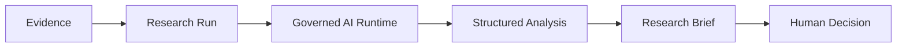

# AI Research Analyst Operationalization Foundation v1.0

Status: Frozen for Sprint 044

## Invariant and ownership

**AI RESEARCH ≠ BUSINESS AUTHORITY.** Intelligence owns Research Runs, evidence references, findings, citations, confidence, and research briefs. AI Runtime owns provider execution, provenance, usage, and operational cost evidence. Decision owns recommendations; Governance owns approvals and human review authority. Source domains retain business truth.

Research output cannot create a Market Opportunity, Product Candidate, Product Launch, approval, Product Truth change, publication, customer contact, Growth action, refund, or Finance mutation.

## Research Run lifecycle

`ResearchRun` is tenant-scoped and audited. It references optional project context, a model capability, optional governed prompt version, the canonical AI request, resulting analysis, and optional human Decision Queue item. Lifecycle is `draft → queued → running → completed`, with `running → failed` and `draft/queued → cancelled`. Terminal states never reopen.

`ResearchRunEvidence` stores source type, source record ID, safe reference, and supplied confidence. It does not copy evidence payloads. Queueing requires at least one valid tenant-scoped evidence reference; missing evidence is reported rather than fabricated.

## Governed templates

Five deterministic templates define goal, acceptable evidence categories, advisory output classification, and the shared structured schema:

- Product opportunity discovery (`candidate`)
- Customer pain analysis (`analysis`)
- Market trend analysis (`analysis`)
- Competitor research (`analysis`)
- GEO content research (`draft`)

The schema requires summary, key findings, evidence used, customer language, confidence, risks, and unanswered questions. Sprint 043 validates the response. Malformed output fails the AI request and the Research Run safely.

## Evidence and citations

Supported run references include market signals, marketplace reviews, customer pain clusters, customer language, opportunity evidence, and existing research citations. Each persisted citation records source type/reference, relevance confidence, citation location, methodology version, and explicit missing-evidence state. Unsupported claims are never silently accepted.

## Worker and AI Runtime composition

The existing worker composition root accepts only an explicit tenant-scoped service identity. It creates a canonical Sprint 043 request, passes reference-only evidence context and the template schema, executes through the provider router, records cost/usage/provenance, creates a draft Research Analysis, attaches evidence citations, and completes or fails the run. Service identity has no human approval authority.

## Human review and downstream boundary

Completed high-impact research may be placed in the Governance Decision Queue with required action `review`. This creates no ApprovalRequest and grants no execution authority. Opportunity Research Briefs remain compositions over existing evidence and analyses; a human/governed downstream workflow must separately decide whether to create or change any business record.

## API and security

Authenticated `/api/v1` APIs create, list, inspect, queue, cancel, and read Research Run results; list templates; and optionally request Decision Queue review. Existing authentication, read/write RBAC, tenant isolation, audit logging, provider secret isolation, authority gates, and rate/cost controls apply.

Structured output follows the JSON Schema mechanism documented by the official OpenAI Responses API while remaining provider-neutral through the Sprint 043 adapter contract.
