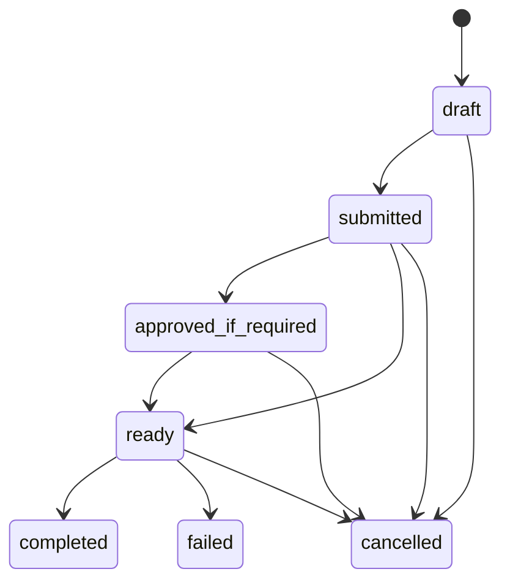

# AI Runtime Foundation v1.0

Status: frozen provider-neutral execution contract for Sprint 035

## Ownership

AI Runtime is a controlled capability layer within the modular monolith, not a business domain and not an authority owner. Governance owns provider policy, authentication, authorization, approvals, prompt-control standards, and audit. Each requesting domain owns its purpose and context. Build owns generated artifact records, Finance owns monetary truth, and the originating business domain owns any accepted change to source truth.

AI Runtime may analyze supplied context, classify it, generate drafts, recommend actions, and produce candidates or artifacts for review. It cannot approve, pay, refund, publish, contact a customer, change financial truth, or execute a business workflow.

## Provider abstraction

The provider registry is organization scoped and records provider identity, availability, registry version, and advisory cost metadata. Model capabilities record model identity/version and one metadata capability: text generation, image generation, video generation, embedding, classification, vision, or speech. These records contain no credentials, client SDKs, endpoints, or provider execution code.

Provider and model identities are operational configuration, never business truth. Disabling a provider or capability prevents a request from entering `ready`. A future adapter must implement a separate port and preserve this contract; provider-specific payloads cannot leak into owning-domain records.

## Request lifecycle

A request stores its verified human requester, organization, purpose, context reference, selected capability, optional Governance approval, status, output classification, output metadata, and failure reason. `ready` requires an available capability/provider. If an approval is linked, it must be approved before `ready`. Approval is referenced, never inferred from AI output.

Sprint 035 does not enqueue, call, retry, or execute a model. `completed` represents a governed metadata result supplied by an authorized caller, not proof that this repository invoked an external provider.

## Output governance

Allowed classifications are `recommendation`, `draft`, `analysis`, `candidate`, and `classification`. A completed request requires one of these values. Approval, payment, refund, publishing, and financial commitment are deliberately absent from the schema and service contract. Output metadata is untrusted provenance and artifact-reference data; it cannot write back to source truth.

Human review and the owning domain's normal command path are required before any output affects product, customer, financial, operational, growth, or governance state.

## Prompt management

Prompt purposes name the owning business domain and lifecycle state. Templates have an accountable human owner. Versions are immutable, sequential records with configuration and author identity. Evaluations are human-supplied, scored observations linked to one version. Every creation and evaluation is audited. Prompts must use references or minimized context; secrets and unnecessary PII are forbidden.

## Security boundary

All AI Runtime APIs inherit the Sprint 034 boundary: verified authentication, organization validation, `api.read`/`api.write` RBAC, then runtime/domain validation. Cross-tenant provider, model, prompt, request, project, and cost references are rejected. Service identities receive no human approval authority. Future workers must preserve service and initiating-actor identity.

Provider credentials remain external secrets and are intentionally absent. No network adapter exists in Sprint 035.

## Cost tracking

AI cost observations record provider, model capability, usage quantity/unit, estimated cost/currency, optional project, and optional request. Decimal values use six-place precision and must be nonnegative. These observations support monitoring and allocation but are advisory; Finance remains the only source of monetary truth. Actual invoices, payments, accruals, and ledger entries are outside this runtime.

## Audit and observability

Provider/capability registration, request creation/transitions, prompt creation/version/evaluation, and cost observations produce Governance audit records with actor, organization, resource, action, timestamp, and result. Future execution must also record correlation, latency, provider response reference, safety result, token/unit usage, and sanitized failure details without logging prompts, secrets, or sensitive output by default.

## Explicit exclusions

No LLM or media-model call, agent loop, autonomous research, connector, Shopify action, marketplace ingestion, advertising, customer messaging, publishing, refund, payment, or automated business execution is implemented.

## References

- [Architecture Freeze](./ARCHITECTURE_FREEZE_V1_1.md)
- [Deployment Topology](./DEPLOYMENT_TOPOLOGY_V1_0.md)
- [Module Boundary](./MODULE_BOUNDARY_V1_0.md)
- [Production Authorization Foundation](../security/PRODUCTION_AUTHORIZATION_FOUNDATION_V1_0.md)
- [Finance Authority Model](../governance/FINANCE_AUTHORITY_MODEL_V1_0.md)
