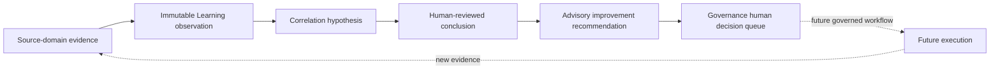

# Closed-Loop Revenue Learning Foundation v1.0

Status: Frozen for Sprint 042

## Ownership and objective

Learning owns immutable observations, cross-domain evidence synthesis, root-cause hypotheses, reviewed conclusions, improvement recommendations, and feedback traceability. Source domains retain exclusive authority over their records. Learning references—not copies or mutates—customer, product, performance, operational, and Finance truth.

The objective is long-term risk-adjusted contribution profit and customer value, not isolated revenue, CTR, ROAS, or conversion.

## Evidence and observations

`LearningObservation` implements the canonical `LearningRecord` contract as an append-only, tenant-scoped reference to an authoritative record. It supports customer, conversation, support, Growth, creative, channel, revenue, cost, contribution-profit, refund, dispute, product-risk, and market evidence. Project and product context are optional references. Monetary, customer, and product payloads are not duplicated.

Every observation records source domain/type/ID, observation type and time, a provenance reference, optional bounded confidence, and structured metadata. Updates and deletion are rejected.

## Hypotheses and conclusions

`RootCauseHypothesis` links supporting and contradicting observations. Its language is explicitly correlational: causal-certainty phrases are rejected. States are `draft`, `under_review`, `supported`, and `rejected`. Supported status requires at least two supporting observations and deterministic minimum evidence coverage and confidence of 0.5.

`LearningConclusion` snapshots supporting and contradicting IDs from the hypothesis. Supported status requires a supported hypothesis, two supporting observations, minimum evidence, an authenticated reviewer, review time, and review metadata. No LLM or provider generates content.

## Recommendations and priority

`ImprovementRecommendation` is advisory and targets product, listing, GEO content, creative, channel, customer support, sales, logistics, pricing, supplier, or experiment review. It cannot mutate Product Truth, listings, creatives, budgets, pricing, suppliers, orders, customers, Sales Opportunities, or Finance truth.

Priority formula `risk-adjusted-learning-v1.0` uses only supplied 0–100 inputs. Missing inputs remain null and are listed. Present inputs are normalized using documented weights for commercial impact, evidence, customer frequency/severity, financial impact, refund/dispute risk, inverse effort, reversibility, and testability. Explanation components preserve each weighted contribution. No value is fabricated.

## Governance composition

Only recommendations scoring at least 75 or carrying supplied refund/dispute risk of at least 80 may be placed in the Governance Decision Queue. Queue placement creates a human `review` prompt with no ApprovalRequest, approval, or execution authority.

## Projections and security

The feedback-loop endpoint composes the full chain and explicitly lists missing priority, human decision, future execution, or new-evidence stages. The Learning dashboard exposes advisory counts for hypotheses, conclusions, highest priorities, recurring customer problems, revenue-leakage references, refund/dispute evidence, creative/channel evidence, and coverage gaps. It never duplicates Finance truth.

All endpoints use Sprint 034 authentication, RBAC, organization scope, and mutation audit records. No AI runtime invocation, agents, autonomous execution, or source-domain writes are included.
