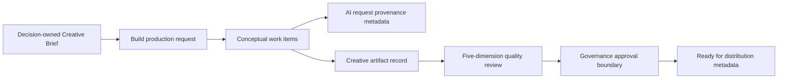

# Creative AI Production Foundation v1.0

Status: Frozen for Sprint 039

## Ownership

Decision owns Creative Strategy and Creative Brief intent. Build owns production requests, conceptual work, AI provenance links, artifact records, versions, and quality reviews. Governance owns approval authority. Growth owns any future distribution or publishing execution. Finance owns costs and monetary truth.

AI supplies advisory metadata only. It does not approve, generate binary media, publish, spend, or execute distribution.

## Production lifecycle

Production requests move `draft → submitted → review → approved`. A draft, submitted, or review request may be cancelled. The approved transition requires an approved Governance request whose object and action explicitly match the production request. No state publishes an artifact.

## Work items

Build may record storyboards, image concepts, video concepts, copy drafts, and UGC concepts. Work metadata is descriptive only and rejects fields that imply publishing, spending, payment, approval, provider calls, or execution.

## AI capability usage

An optional provenance link connects a production request and work item to a Sprint 035 AI request. Allowed classifications are analysis, draft, candidate, and classification. Completed AI request classifications must match the production provenance record.

No provider invocation, queue, autonomous agent, image generation, video generation, or content generation is implemented. Output metadata cannot encode publish, spend, payment, approval, execution, or provider-call authority.

## Artifact lifecycle

Sprint 027 `CreativeAsset` remains the artifact registry and retains source and metadata. Sprint 039 adds an optional production-request link, review status, and aggregate quality score. `CreativeAssetVersion` remains the version source of truth and assigns monotonically increasing versions.

Production artifacts begin as draft, pending approval, and unreviewed. A quality review moves the artifact into review. Governance-approved production plus a completed quality review is required for artifact approval. Only an approved artifact may become `ready_for_distribution`. That status is planning metadata and grants Growth no publishing authority.

## Quality gates

The existing Build-owned creative quality review is extended to score:

- brand consistency
- claim safety
- product accuracy
- channel suitability
- customer relevance

Each score is bounded from 0 to 100. The overall quality score is their deterministic arithmetic mean. Issues and a human recommendation remain visible. Quality scoring does not substitute for Governance approval.

## Security and audit

- Sprint 034 authentication, organization resolution, and RBAC apply to every endpoint.
- Project, brief, product, work, AI request, approval, and artifact references are tenant validated.
- Production, provenance, quality, approval, and artifact lifecycle mutations are audited.
- Approval records must be explicit, approved, organization scoped, and bound to the exact production request.
- Ready-for-distribution metadata cannot call a Growth adapter or external API.

## Explicit exclusions

No LLM calls, image generation, video generation, binary asset storage, publishing, ads, Shopify, external APIs, autonomous agents, spend, or distribution execution is included.
