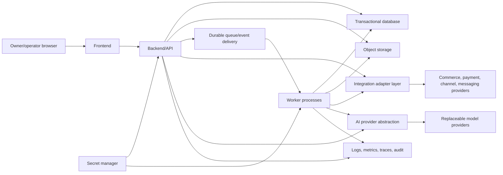

# Commerce OS Deployment Topology v1.0

Status: logical vendor-neutral topology; no implementation stack selected

## V1 topology

## Components and boundaries

| Component | Responsibility | Boundary/control |
|---|---|---|
| Frontend | Authenticated owner/operator interface and read/command presentation | No secrets, direct database access, authority decisions, or trusted validation |
| Backend/API | Authentication boundary, authorization/policy checks, domain commands/queries, approval enforcement | Stateless where practical; business truth persists only through owning repositories |
| Transactional database | Canonical aggregates, approval/audit references, outbox, registry/configuration | Transactional integrity, encryption, backup/PITR, least privilege; technology not selected |
| Object storage | Large creative assets, documents, sensitive content references, exports | Organization-prefixed access, encryption, signed short-lived access, lifecycle/retention controls |
| Queue/event system | Durable asynchronous delivery of committed business events/jobs | At-least-once assumption, idempotent consumers, retries/dead-letter handling; database outbox prevents dual-write loss |
| Worker processes | Background integrations, projections, backfills, model execution, event consumers | Same policy/identity controls as API; bounded retries and cost/time limits |
| AI provider abstraction | Normalized capability requests/results, routing, provenance, safety/cost/data policy | Providers never receive authority credentials or own canonical state; disable/fallback/version pinning |
| Integration layer | Adapters for commerce, payments, messaging, ads, suppliers, and channels | Normalizes IDs/receipts, verifies callbacks, rate limits, isolates credentials, supports replacement |
| Secret manager | Runtime delivery and rotation of credentials/keys | No secret values in code, client, logs, events, prompts, or database configuration records |
| Observability/audit | Operational logs/metrics/traces plus protected business audit | PII minimization, correlation IDs, tamper-evident audit, retention/access controls |

## Deployment principles

- Begin with the smallest operational unit consistent with boundaries: one frontend, one backend deployment, one worker deployment, one transactional database, object storage, and durable event delivery.
- Logical domains need not be separately deployed services in V1. Enforce module ownership in code/contracts first; split deployments only for measured scaling, security, or reliability needs.
- Separate local/development, test/staging, and production identities, data, credentials, and provider accounts. Production access is audited and least privilege.
- Use reproducible build artifacts, declarative configuration, forward-compatible migrations, health checks, controlled rollout/rollback, backups, and recovery tests.
- Select technologies through architecture decision records based on transactional guarantees, operability, portability, cost, recovery, and team capability—not provider-specific convenience.

## Failure and recovery assumptions

Provider calls fail independently; queues deliver more than once; callbacks may be delayed, duplicated, forged, or reordered; model output is untrusted; storage can be temporarily unavailable. Commands use idempotency keys, events use correlation/causation, integrations reconcile receipts, and consequential partial failure enters visible exception/handoff state rather than silently retrying financial action.
