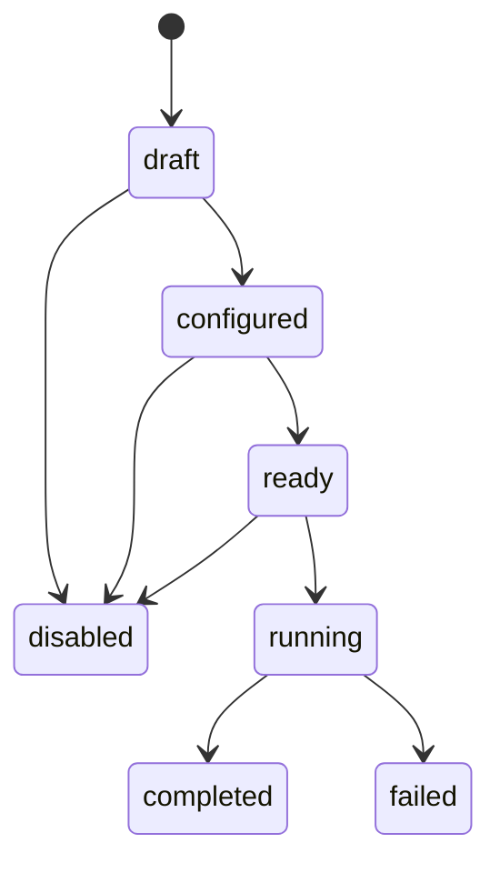

# External Intelligence Connector Foundation v1.0

Status: frozen secure ingestion contract for Sprint 036

## Ownership and evidence boundary

Intelligence owns connector definitions, ingestion state, immutable external evidence, and normalized evidence records. Governance owns authentication, authorization, audit policy, and credential-access policy. Sprint 035 AI Runtime may later consume explicit references through a governed AI request, but it does not ingest, normalize, interpret, or promote external evidence automatically. Decision owns recommendations.

External data is evidence only. Connector or normalization records cannot directly create an opportunity, product, customer, campaign, approval, or decision. Promotion requires an explicit downstream domain command with its normal evidence, authority, and approval checks.

## Connector registry

The existing market connector registry is generalized rather than duplicated. Every definition is tenant scoped and records connector type, provider/platform, capability, lifecycle status, non-secret configuration metadata, authentication state, optional external credential reference, and rate-limit metadata.

Credential references must use the `secret://` scheme. The database never stores access tokens, API keys, passwords, private keys, or provider secrets. Configuration, rate-limit, raw-record, and normalization metadata reject secret-like keys. A production adapter must resolve credentials at runtime using its least-privilege service identity and must never copy the resolved value into logs, records, errors, prompts, or events.

## Connector and ingestion lifecycle

Connector lifecycle is `draft → configured → ready`, with `disabled` available before execution. Legacy connector states remain readable for compatibility. `ready` requires authentication state `verified` or `not_required`.

Generic ingestion lifecycle is:

Jobs record connector, start/end time, processed count, sanitized structured errors, and status. Sprint 036 transitions these records only; it adds no scheduler, queue consumer, HTTP client, scraper, or external source call.

## Raw evidence ownership and immutability

Each raw record stores tenant, connector, external source reference, content type, caller-supplied raw content, sanitized payload metadata, capture time, SHA-256 payload hash, and idempotency key. The hash is calculated from canonical source reference, content type, raw content, and metadata.

An organization/connector/idempotency key may identify only one payload. Repeating the same request returns the existing record; reusing the key for different content fails. Duplicate payload hashes for the connector collapse to the existing evidence. Application listeners and a PostgreSQL trigger reject update or delete, so corrections are appended as new evidence rather than overwriting history. Retention/legal deletion requires a separately governed process and migration, not normal connector APIs.

## Normalization boundary

Normalized items reference one immutable raw record and add category, topic, source language, content/customer language, signal type, source occurrence time, relevance metadata, and bounded confidence. Normalization is a supplied contract, not insight generation. It neither changes the raw record nor creates a signal, insight, opportunity, or recommendation.

Source provenance remains resolvable through the raw record and connector. Confidence describes normalization confidence only; it is not business confidence or approval.

## Authentication, authorization, and audit

All connector APIs inherit Sprint 034 verified authentication, organization validation, RBAC, and Intelligence domain checks. Cross-tenant references return no resource. Connector creation/transitions, ingestion transitions, raw capture, and normalization create Governance audit records with organization, actor, action, resource, timestamp, and result. Service identities cannot approve and future workers must preserve both service identity and initiating actor.

Sprint 035 output governance remains intact: connector evidence may become explicit AI context only through the governed AI request lifecycle, and any AI result remains a draft, analysis, candidate, classification, or recommendation without write authority.

## Failure and rate-limit principles

- Adapters must apply provider-specific quotas behind a provider-neutral port, with per-tenant budgets and bounded concurrency.
- `429` and transient failures use bounded backoff with jitter; permanent authentication or policy failures disable readiness and require human intervention.
- Retries must reuse idempotency keys and cannot duplicate raw evidence.
- Sanitized error metadata may contain codes, retryability, and correlation references, never secrets or unrestricted provider payloads.
- Partial jobs retain processed evidence and finish visibly as failed; they do not silently roll back immutable captures.
- Circuit breaking, dead-letter handling, reconciliation, and provider health belong to a future execution adapter sprint.

## Explicit exclusions

No new external call, autonomous research, LLM analysis, agent, Reddit execution, Amazon/Etsy scraping, Shopify integration, advertising, customer outreach, opportunity creation, recommendation, or business execution is added.

## References

- [Market Intelligence Connector Foundation](./MARKET_INTELLIGENCE_CONNECTOR_FOUNDATION_V1_0.md)
- [AI Runtime Foundation](./AI_RUNTIME_FOUNDATION_V1_0.md)
- [Production Authorization Foundation](../security/PRODUCTION_AUTHORIZATION_FOUNDATION_V1_0.md)
- [Domain Ownership Model](../governance/DOMAIN_OWNERSHIP_MODEL_V1_0.md)
- [Data Ownership Contract](../governance/DATA_OWNERSHIP_CONTRACT_V1_0.md)
