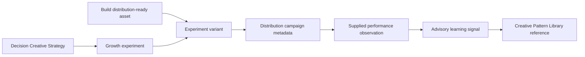

# Growth Experiment and Performance Foundation v1.0

Status: Frozen for Sprint 040

## Ownership

Growth owns experiment definitions, variants, distribution planning records, supplied performance observations, and learning signals. Decision continues to own Creative Strategy and recommendations. Build continues to own Creative Assets and their review lifecycle. Governance alone owns approval authority. Finance remains the source of truth for revenue, cost, and profitability.

Sprint 040 records a controlled learning workflow. It does not publish, buy media, change budgets, call a channel API, or optimize activity automatically.

## Experiment lifecycle

Experiments move `draft → review → approved → active → completed`. Draft, review, approved, or active records may be cancelled where the state machine permits. Approval requires a Governance request explicitly bound to the experiment. Activation is impossible without that approval.

An experiment references, but does not modify, a Decision-owned Creative Strategy. Its owner is the authenticated human actor who created the record. Variants may reference only Build-owned assets marked ready for distribution.

## Distribution workflow

`DistributionCampaign` is a planning and lifecycle record, not a publishing adapter. It binds an experiment variant asset to TikTok, Instagram, Pinterest, Facebook, YouTube, or Reddit metadata. Its channel must match the parent experiment.

Campaigns follow `draft → review → approved → active → completed`, with controlled cancellation. The approved transition requires an exact Governance approval, and active requires that persisted approval. No state invokes an external service. The pre-existing execution-oriented distribution records remain separate from this pre-execution campaign contract.

## Metrics ownership

Growth observations accept supplied impressions, clicks, engagement, conversion, confidence, and an optional reference to a Finance-owned revenue observation. Counts are non-negative, decimal measures use six-place precision, and confidence is bounded from zero to one.

The optional revenue reference is read-only. Growth does not calculate, overwrite, or claim ownership of revenue, costs, margin, or profitability. An observation must reference an asset registered as a variant of the same experiment.

## Learning loop

A `GrowthLearningSignal` cites one or more observations from one experiment and records a pattern, confidence, and advisory recommendation. It may reference an existing Decision-owned Creative Pattern Library item. The link enriches future review; it does not rewrite the pattern, alter Creative Strategy, approve an experiment, or trigger a new campaign.

Every learning claim retains direct observation links. Confidence expresses evidentiary strength, not execution authority.

## Approval and security boundaries

- Sprint 034 verified authentication, tenant resolution, and RBAC protect all APIs.
- Project, strategy, asset, experiment, observation, revenue, approval, and pattern references are organization scoped.
- Experiment, campaign, performance, and learning mutations create audit records with the initiating actor.
- Governance approval is mandatory before an experiment or distribution campaign becomes active.
- A service or AI identity cannot substitute for human Governance approval.
- No route exposes publishing, channel credentials, budget mutation, automatic optimization, or external execution.

## Explicit exclusions

No external ad or social APIs, Meta, TikTok, Pinterest, publishing, budget changes, automatic optimization, AI agents, generated metrics, or financial execution are included.
