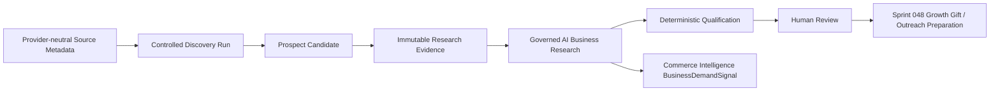

# GrowthOS Prospect Discovery Foundation v1.0

Status: Frozen for Sprint 049

## Architecture position and ownership

GrowthOS Prospect Discovery is a controlled evidence-acquisition and business-research workflow built on the CommerceOS kernel. Growth owns discovery workflow, candidate state, qualification, and the founder-facing projection. CommerceOS Intelligence owns reusable `BusinessDemandSignal` records. AI Runtime owns governed inference and provenance. Governance retains approval authority, and Operations, Finance, Build, and Decision retain their existing source-of-truth boundaries.

No stage scrapes, contacts, approves, invoices, or creates Sales Opportunities. `BusinessDemandSignal` is an intelligence input, never an opportunity or execution instruction.

## Source and discovery workflow

`ProspectDiscoverySource` stores tenant-scoped source type, name, capability, lifecycle, and non-secret configuration metadata. Google Maps, websites, Instagram, LinkedIn, and manual sources are representable, but Sprint 049 implements no provider adapter or external call. The abstraction is compatible with the Sprint 036 connector security model; it does not duplicate connector credentials or ingestion infrastructure.

`ProspectDiscoveryRun` follows `draft → queued → running → completed|failed`, with cancellation allowed before running. Terminal states never reopen. Candidate registration is an internal ingestion contract used only while a run is running.

`ProspectCandidate` exists before a Sprint 048 `GrowthProspect`. A normalized SHA-256 key over business name, website, and location provides tenant-scoped idempotency. Repeated discovery returns the existing candidate rather than producing duplicates.

## Evidence model

`ProspectResearchEvidence` stores source-referenced observations with collection time and confidence. It is append-only: ORM mutation and deletion hooks reject changes, and PostgreSQL installs a trigger covering both operations. The API exposes creation and reading only.

Research cannot start without at least one tenant-scoped evidence record. Evidence identifiers and observations are supplied to the governed runtime; missing information remains explicit. The system never fabricates pain points or replaces evidence with AI conclusions.

## Governed AI research and limitations

`GrowthBusinessResearchRun` composes the Sprint 043 governed AI Runtime with an explicit service identity, registered model capability, optional approved prompt version, structured schema, cost/provenance tracking, and `analysis` output classification. Required output contains summary, business profile, evidence summary, potential growth issues, confidence, missing information, and risk.

The worker can store a `GrowthBusinessResearchResult` and evidence-linked `BusinessDemandSignal` records. It cannot create Market Opportunities, Sales Opportunities, invoices, approvals, external messages, Growth Gifts, or any other execution record. Provider selection remains metadata-driven; `AIModelPolicy` supports `prospect_research`, `business_analysis`, and `customer_reply_analysis` without provider hardcoding.

## Qualification

Qualification is deterministic:

`pain × 35% + purchase probability × 30% + accessibility × 20% + quick-win potential × 15%`

Every input is bounded from 0 to 100. If any input is absent, the final score remains null and the missing fields are stored. Complete scores at or above 70 mark a candidate qualified; this is a deterministic workflow classification, not AI approval. Formula version, supplied inputs, missing inputs, and explanation are auditable.

## API, dashboard, and security

Authenticated `/api/v1` endpoints cover sources, discovery-run creation/list/detail/queue/cancel, candidate reads, evidence creation/reads, business-research start/results, qualification calculation/read, AI provenance, and Business Demand Signal reads.

The GrowthOS dashboard extends Sprint 048 with discovery counts, research-run counts, qualified candidates, top advisory research results, average available qualification score, and pending human review. It remains read-only and does not duplicate Finance truth.

Universal authentication, RBAC, organization scope validation, tenant isolation, immutable evidence, service-identity enforcement, and audit logging apply. Sprint 049 includes no scraper, browser automation, email/social sending, autonomous agent, CRM replacement, SaaS feature, or external provider implementation.
