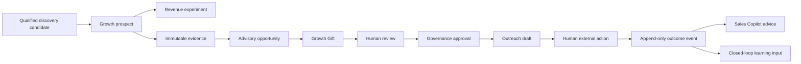

# GrowthOS Revenue Activation Foundation v1.0

Status: Frozen for Sprint 050

## Purpose

GrowthOS Revenue Activation moves a qualified discovery candidate into a controlled,
founder-operated revenue experiment. It connects evidence, an advisory opportunity,
a reviewed Growth Gift, a structured outreach draft, human approval, manually reported
conversation outcomes, Sales Copilot advice, and learning signals. GrowthOS remains an
internal operating system, not a SaaS product, customer portal, CRM, billing platform, or
autonomous sales agent.

## Ownership and source-of-truth boundaries

Growth owns prospect workflow state, evidence, experiment assignment, Growth Gift state,
outreach preparation, manually supplied tracking observations, and GrowthOS projections.
Decision owns advisory opportunity and reply recommendations. Governance alone owns
approval authority. AI Runtime owns provider-neutral request provenance. Learning owns
conclusions created from observations. Finance, Product Truth, Customer master records,
orders, invoices, and payments remain outside GrowthOS authority.

An experiment and its assignments are organization-scoped. This tenancy boundary preserves
the existing architecture; it is not a public multi-tenant product feature. No customer-facing
account, billing, marketplace, or onboarding capability is introduced.

## Revenue experiment contract

`RevenueExperiment` records the target segment, offer type, and message strategy under the
`draft → active → completed → archived` lifecycle. A qualified prospect can be assigned once
per experiment through `ProspectExperimentLink`. Its result is one of `pending`, `contacted`,
`replied`, `positive`, `negative`, or `converted`.

`OutreachTrackingEvent` is append-only and records `draft_created`, `approved`,
`sent_manually`, `reply_received`, `follow_up_needed`, and `converted`. The API records facts
supplied after a human action; it has no transport adapter. A manual-send event requires an
outreach draft whose matching Governance approval has already been accepted. Database and
ORM protections reject event update or deletion.

These assignments and observations make offer/message conversion measurable without
claiming Finance revenue truth. Meetings, purchases, or revenue can be represented only by
authorized evidence or downstream domain references; GrowthOS does not create them.

## Evidence-to-outreach chain

A discovery candidate must be deterministically qualified before promotion to a Growth
prospect. Promotion retains the candidate identifier and is idempotent. Opportunity evidence
must belong to that prospect. A Growth Gift must cite a non-empty subset of the opportunity's
evidence and therefore cannot exist as an unsupported generic offer.

Growth Gifts move through:

`draft → review → approved → ready_for_delivery → delivered`

The `approved` transition requires a matching, approved Governance request for that exact
organization, object, and action. Later delivery states preserve that approval identifier.
`delivered` is a record of founder-controlled delivery; no automatic delivery exists.

Outreach drafts retain evidence identifiers and structured components: subject options,
opening sentence, personalized context, problem observation, Growth Gift explanation, and a
soft call to action. Validation rejects known generic agency and AI-authorship phrases. The
draft lifecycle remains `draft → human_review → approved → sent`; approval is object-scoped,
and `sent` records a human-controlled external action only.

## Sales Copilot and AI authority

Sales Copilot stores the supplied customer reply plus advisory intent, sentiment, buying
signal, objection type, recommended next action, and reply draft. It may not send, negotiate,
approve a discount, promise delivery, create a contract, or mutate customer and Finance truth.

Every AI-derived artifact references a completed, tenant-scoped governed AI request with task
type, selected model identity, and allowed output classification. `AIModelPolicy` remains
provider neutral and now supports low-cost tasks such as prospect summarization, evidence
classification, and draft variations, plus higher-reasoning tasks such as opportunity
evaluation, customer reply analysis, and final outreach polishing. Policies are metadata; they
do not invoke providers or grant authority.

## Security, APIs, and dashboard

All endpoints are under `/api/v1` and inherit verified authentication, organization scope,
RBAC, route-domain authorization, and audit logging. New endpoint families activate qualified
candidates, manage revenue experiments and assignments, and append outreach events. There is
no intentionally public GrowthOS endpoint.

The dashboard adds active experiments, candidates awaiting review, Growth Gifts ready,
outreach drafts awaiting approval, replies, positive conversations, and conversion signals.
These are read-only operating projections and cannot execute actions or replace source truth.

## Explicit exclusions

Sprint 050 adds no email or social sender, browser automation, autonomous agent, customer
account, billing, marketplace, CRM, payment, invoice, discount, contract, external connector,
new provider integration, or automatic learning conclusion. External communication and all
commercial commitments remain human controlled.
