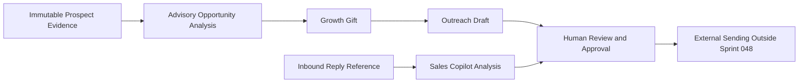

# GrowthOS Revenue Engine Foundation v1.0

Status: Frozen for Sprint 048

## Purpose and architecture position

GrowthOS is the founder-operated revenue application layer on the CommerceOS kernel. It is not a public SaaS product, tenant marketplace, or generic CRM. It turns business-specific evidence into controlled prospect research, advisory opportunities, Growth Gifts, reviewed outreach drafts, reply analysis, and learning inputs.

The existing Intelligence, Build, Decision, Governance, Operations, Finance, Growth, Learning, and AI Runtime ownership model remains unchanged.

## Data ownership

Growth owns prospect workflow state, prospect evidence, Growth Gift records, outreach preparation, and GrowthOS projections. Decision owns advisory opportunity and reply recommendations. Governance owns approval authority. AI Runtime owns provider execution and provenance. Finance remains the sole authority for revenue, cost, invoices, discounts, payments, and profitability truth.

`GrowthProspectEvidence` is append-only. The application and PostgreSQL trigger reject updates, and the API exposes creation and reading only. Analyses retain exact evidence identifiers rather than replacing evidence with conclusions.

The dashboard is a read model over GrowthOS workflow records. It does not duplicate Finance truth and cannot execute workflow transitions.

## Controlled workflow

Prospects move through `discovered → researching → qualified → contacted → replied → customer`, with disqualification allowed before terminal customer state. `contacted` requires a previously human-approved outreach record marked sent; Sprint 048 stores that externally supplied outcome but does not send anything.

Growth Gifts use `draft → review → approved → sent`. Outreach drafts use `draft → human_review → approved → sent`. Approval transitions require a matching approved Governance request for the same organization, object, and action. The `sent` state is a record of a human-controlled external action; no endpoint performs transmission.

Opportunity analyses are advisory and cannot create Sales Opportunities, invoices, financial observations, products, or approvals. Sales Copilot analyses can recommend an action and suggest a reply, but cannot mutate conversations or communicate externally.

## AI boundaries and routing preparation

GrowthOS reuses the governed AI Runtime introduced in Sprints 035 and 043. AI-derived outreach and sales analyses must reference a completed, tenant-scoped AI request with task type, selected model provenance, and an allowed classification. Allowed classifications are analysis, recommendation, or draft according to the output record. Approval, publishing, sending, spending, discounts, payments, refunds, and financial commitments remain forbidden.

`AIModelPolicy` is tenant-scoped routing metadata for a future cost/quality router. It records preferred and fallback model identities and a quality requirement; it neither switches providers nor executes requests.

## Security and non-goals

All GrowthOS APIs are under `/api/v1` and inherit verified authentication, organization validation, RBAC, domain authorization, and audit logging. Evidence and all downstream records are tenant-scoped. Sensitive provider credentials remain outside GrowthOS storage.

Sprint 048 does not include scraping, browser automation, email or social sending, autonomous agents, a full CRM, billing, customer portals, public onboarding, external user management, or any new AI provider integration.
