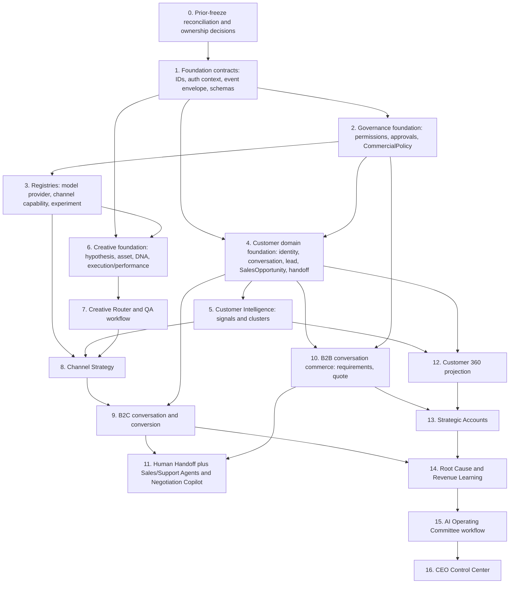

# Architecture v1.1 Implementation Dependency Graph

This order refines the mission sequence by separating authority/security foundations from customer schemas before any agent or channel execution. It is a planning dependency graph, not an implementation schedule. Evidence for the refinement is the absence of approval, event, permission, schema, and identity foundations documented in [repository discovery](./REPOSITORY_DISCOVERY_AND_DRIFT.md) and risks in the [gap analysis](./ARCHITECTURE_GAP_ANALYSIS_V1_1.md).

## Stage exit gates

| Stage | Required exit evidence |
|---|---|
| 0 | Prior freeze located; object equivalence and state owners signed off. |
| 1–3 | Versioned contracts, threat model, authority matrix, idempotency/replay behavior, provider exit contract. |
| 4 | Identity provenance/confidence, untrusted-message boundary, B2C/B2B separation, handoff lifecycle tests. |
| 5–8 | Lineage, model/creative QA, experiment isolation, provider/channel policy tests. |
| 9–11 | End-to-end authorization, human financial approvals, safe handoff, no provider-owned state. |
| 12–14 | Projection entitlement/deletion tests, attribution uncertainty, Product Truth immutability. |
| 15–16 | Human accountability, read-versus-command separation, least privilege, audit completeness. |

## Critical path

Prior-freeze reconciliation → foundation contracts → governance foundation → customer foundation → B2B/B2C flows → handoff/coplilot → Customer 360/Strategic Accounts → learning/root cause → governance surfaces.

Creative and customer foundations can proceed in parallel only after foundation/governance contracts stabilize. CEO Control Center is last because exposing cross-domain commands before authority and ownership settle would create a competing source of truth.
