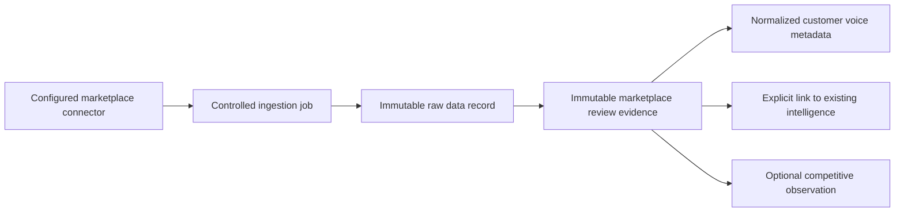

# Marketplace Customer Voice Foundation v1.0

Status: Frozen for Sprint 037

## Purpose and ownership

Marketplace reviews are external customer evidence owned by Intelligence. They may support customer intelligence, pain discovery, product learning, and evidence attached to an existing opportunity. They do not own products, opportunities, decisions, listings, campaigns, customers, or execution.

Governance owns authentication, authorization, audit policy, and credential controls. The external marketplace remains the origin of the observed review; Commerce OS owns the captured evidence record and its provenance, not the external truth.

## Connector relationship

Amazon- and Etsy-compatible sources use the Sprint 036 provider-neutral connector registry with the `read_marketplace_reviews` capability. Connector metadata declares marketplace type, source identity, authentication state, lifecycle, and rate-limit policy. Authentication material is represented only by `secret://` references. This foundation performs no provider calls, scraping, posting, or customer contact.

## Evidence lifecycle

Review evidence records are tenant-scoped and bind a connector, raw source record, source identity, product reference, rating, review date, safe metadata, optional verified indicator, and SHA-256 identity. Source identity and evidence hash provide idempotency. Application events and a PostgreSQL trigger reject updates and deletes.

Duplicate capture returns the original evidence when its canonical hash matches. Reusing a source identity with changed evidence is rejected.

## Normalization boundary

Normalization stores supplied sentiment metadata, topic metadata, customer language, product reference, and bounded evidence confidence. These fields describe evidence; they are not conclusions, recommendations, classifications generated by AI, or Product Truth.

No normalized review automatically creates a customer signal, pain cluster, customer-language insight, or opportunity evidence. An explicit tenant-validated link may associate review evidence with an already-existing record in one of those families.

## Competitive observations

An optional competitive observation records a competitor reference, supplied product observations, preference signals, recurring complaints, observation count, and confidence. It is advisory evidence only and cannot modify Product Truth, launch state, pricing, listings, or decisions.

## Privacy

- Do not persist reviewer names, email addresses, marketplace account identifiers, or other direct identifiers.
- Source identities must identify the review record, not the person.
- Review text remains in the immutable Sprint 036 raw record; normalized records retain only customer language needed for the documented intelligence purpose.
- Tenant scope applies to capture, reads, normalization, linking, and observations.
- Retention and deletion exceptions require Governance review because immutability and privacy obligations may conflict.

## Compliance boundaries

- Only evidence obtained through an authorized future source adapter may enter production ingestion.
- Provider terms, robots policies, licenses, geographic restrictions, rate limits, and retention requirements must be approved before a live adapter is enabled.
- Authentication uses Sprint 034 sessions and RBAC. Connector configuration inherits Sprint 036 secret rejection and credential-reference controls.
- Lifecycle mutations and evidence operations create Governance audit events.
- Sprint 035 AI Runtime is not invoked. Any future AI interpretation must create governed advisory output with provenance and may not mutate evidence.

## Explicit exclusions

No Amazon or Etsy API integration, scraping, LLM analysis, agents, Shopify, advertising, messaging, listing creation, opportunity creation, or autonomous business action is included.
