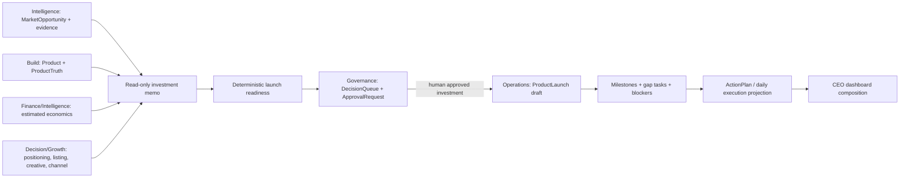

# Opportunity-to-Launch Integration v1.0

Status: first end-to-end architecture integration vertical slice; human-controlled

## Integration findings

The repository already contains every persistence contract required for orchestration. Sprint 033 adds no tables and no competing opportunity score. The orchestration service composes records, labels unavailable evidence, requests Governance review, and delegates launch/task creation to the existing Operations service.

Overlapping names remain deliberately distinct: `OpportunityCandidate` is an advisory discovery hypothesis, `MarketOpportunity` is an evidence-backed market record that can enter governed investment review, VentureOpportunity is a Decision investment concept, SalesOpportunity is an Operations sales pipeline record, and CustomerExpansionOpportunity is strategic-account advice. No automatic conversion occurs among them. In particular, no Candidate-to-MarketOpportunity promotion contract exists.

## Ownership and dependency map

| Domain | Reused records | Orchestration authority |
|---|---|---|
| Intelligence | MarketOpportunity, evidence, assessments/reports, customer-backed need evidence, product candidate, risk and estimated economics | Read only |
| Build | Product and ProductTruth | Read only; Product Truth gate is preserved |
| Decision | Positioning, offer, listing/GEO, creative, channel advice | Read only |
| Governance | ApprovalRequest and DecisionQueueItem | Creates a pending human review; cannot approve itself |
| Operations | Project, ProductLaunch, milestones, tasks, blockers, ActionPlan | Existing service creates draft launch workflow after investment approval |
| Finance | Actual monetary records | Never written; estimated economics remain labeled estimates |

## Investment memo and readiness

The memo retains source IDs and labels conclusions as `observed`, `derived`, `estimated`, or `missing`. It never fabricates missing supplier, Product Truth, economics, or execution data. Readiness evaluates market evidence, customer evidence, solution, risk, economics, supplier, Product Truth, positioning, listing/GEO, creative, channel, and Governance. Each category explains its state and blocking effect. This is preparation readiness, not a new commercial score.

## Controlled activation

Investment review creates one pending ApprovalRequest and one linked decision-queue item. Only a separately approved request for the exact tenant and MarketOpportunity authorizes activation. Activation creates a draft ProductLaunch and gap-derived milestones, tasks, blockers, and ActionPlan. Investment approval does not approve Product Truth or the launch; existing later gates remain mandatory. Generated work is routing metadata only and performs no autonomous action.

## Phase 3.5 source-of-truth audit

Governed investment approval means an `ApprovalRequest` with `status=approved`, `object_type=market_opportunity`, `object_id=<MarketOpportunity.id>`, and `requested_action=approve_investment` in the same organization. `MarketOpportunity.status=qualified` is not approval authority.

Launch readiness is independently computed. `overall_status=ready` means every blocking readiness category is ready; `missing` means one or more blocking inputs are absent, and `blocked` means an explicit blocking condition exists. The current activation endpoint can create a draft, blocked launch when readiness is not ready, so future Phase 4 execution should require both the exact approved investment request and an explicit policy choice about whether `ready` is mandatory.

The future execution record should preserve `MarketOpportunity.id`, its organization, the exact `ApprovalRequest.id`, the readiness snapshot or methodology version used, and the selected Project/Product references. Existing `ProductLaunch` records preserve Project/Product and can preserve a launch approval, but do not currently store the originating MarketOpportunity. Current duplicate prevention is scoped to organization + Project + Product, not MarketOpportunity. These provenance and idempotency gaps are deferred to Phase 4 design; no execution object is created by Phase 3.5.

## Security boundary

The production boundary verifies bearer sessions, derives the actor organization from the authenticated User, rejects a supplied organization that differs from that organization, and applies `api.read` or `api.write` RBAC. Opportunity collections, memo/readiness composition, review requests, Decision Queue access, and activation additionally scope database work by organization.

Phase 3.5 closes a remaining single-record gap: `GET` and `PATCH /opportunities/{id}` now require `organization_id` and query `MarketOpportunity.id + organization_id`. The universal boundary verifies that the required organization equals the authenticated actor's organization. Omitting organization scope is rejected, supplying another tenant is forbidden, and supplying the actor's tenant with another tenant's ID returns not found. Approval decisions do not accept caller organization authority; they derive the target organization from the stored ApprovalRequest and require the human approver to hold `approval.decide` in that exact organization.

## Persistence decision

**NO DATABASE MIGRATION REQUIRED.** Existing entities represent review, launch, milestones, tasks, blockers, and plans without duplicating domain truth.
