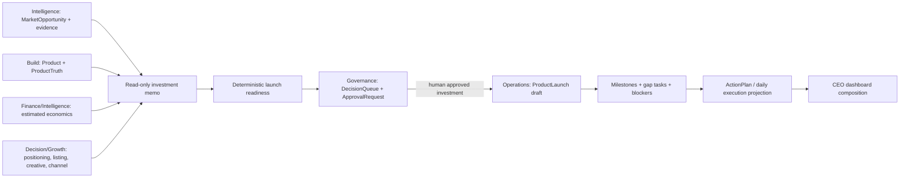

# Opportunity-to-Launch Integration v1.0

Status: first end-to-end architecture integration vertical slice; human-controlled

## Integration findings

The repository already contains every persistence contract required for orchestration. Sprint 033 adds no tables and no competing opportunity score. The orchestration service composes records, labels unavailable evidence, requests Governance review, and delegates launch/task creation to the existing Operations service.

Overlapping names remain deliberately distinct: MarketOpportunity is Intelligence evidence, VentureOpportunity is a Decision investment concept, SalesOpportunity is an Operations sales pipeline record, and CustomerExpansionOpportunity is strategic-account advice. No automatic conversion occurs among them.

## Ownership and dependency map

| Domain | Reused records | Orchestration authority |
|---|---|---|
| Intelligence | MarketOpportunity, evidence, assessments/reports, customer-backed need evidence, product candidate, risk and estimated economics | Read only |
| Build | Product and ProductTruth | Read only; Product Truth gate is preserved |
| Decision | Positioning, offer, listing/GEO, creative, channel advice | Read only |
| Governance | ApprovalRequest and DecisionQueueItem | Creates a pending human review; cannot approve itself |
| Operations | Project, ProductLaunch, milestones, tasks, blockers, ActionPlan | Existing service creates draft launch workflow after investment approval |
| Finance | Actual monetary records | Never written; estimated economics remain labeled estimates |

## Investment memo and readiness

The memo retains source IDs and labels conclusions as `observed`, `derived`, `estimated`, or `missing`. It never fabricates missing supplier, Product Truth, economics, or execution data. Readiness evaluates market evidence, customer evidence, solution, risk, economics, supplier, Product Truth, positioning, listing/GEO, creative, channel, and Governance. Each category explains its state and blocking effect. This is preparation readiness, not a new commercial score.

## Controlled activation

Investment review creates one pending ApprovalRequest and one linked decision-queue item. Only a separately approved request for the exact tenant and MarketOpportunity authorizes activation. Activation creates a draft ProductLaunch and gap-derived milestones, tasks, blockers, and ActionPlan. Investment approval does not approve Product Truth or the launch; existing later gates remain mandatory. Generated work is routing metadata only and performs no autonomous action.

## Security boundary

All Sprint 033 endpoints are affected by the existing production authentication gap: the API has internal password verification and RBAC foundations, but most request paths do not authenticate a verified session/token or enforce actor permissions at every endpoint. `X-Actor-ID` is unverified. Public deployment remains prohibited. Minimum controlled-deployment work is verified OIDC/session or bearer authentication, centralized tenant/action authorization on every route, rate limiting, CSRF protection where cookie sessions apply, and deployment hardening. This should be the primary scope of Sprint 034 before external executable integrations.

## Persistence decision

**NO DATABASE MIGRATION REQUIRED.** Existing entities represent review, launch, milestones, tasks, blockers, and plans without duplicating domain truth.
