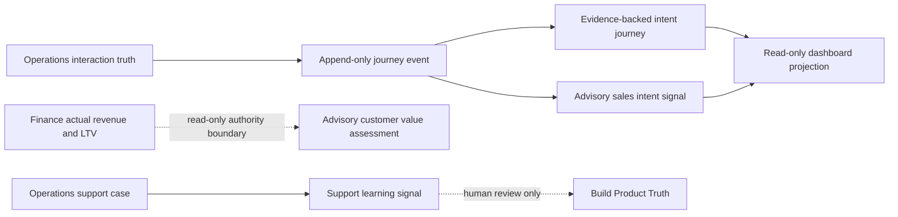

# Revenue Conversation Intelligence Foundation v1.0

Status: Frozen for Sprint 041

## Ownership

Operations owns customers, conversations, interactions, and support case truth. Intelligence owns journey observations, evidence interpretation, behavioral signals, and support learning. Decision owns customer-value and sales recommendations. Finance alone owns actual revenue, monetary contribution, and lifetime value. Governance owns permissions, approvals, and authority.

Sprint 041 is an authenticated, advisory intelligence layer. It cannot contact a customer, create a Sales Opportunity, change Product Truth, issue a quote, discount, refund, payment, or checkout action.

## Customer journey model

`CustomerJourneyEvent` extends the Sprint 031 observation contract with bounded confidence and the Sprint 041 event vocabulary: ad interaction, page view, product interaction, conversation started, question received, purchase intent, quote requested, and support request. Earlier event types remain valid for backward compatibility.

Events are append-only. Their source, source reference, timestamp, metadata, customer, tenant, and confidence are immutable after insertion. New evidence is represented by another event rather than an edit or deletion.

## Interaction ownership

Journey events may reference observed Operations interactions but do not replace conversation threads, messages, customer identity, or support cases. Evidence references are tenant checked. Conversation evidence must resolve through a message and thread to the same customer.

## Sales intelligence boundary

`CustomerIntentJourney` has the stages `unknown`, `aware`, `interested`, `considering`, `high_intent`, `customer`, and `repeat_customer`. `unknown` may be initialized without evidence. Every transition requires one or more validated evidence references and an explicit confidence score; there are no automatic transitions.

`SalesIntentSignal` records evidence, intent type, confidence, and an advisory recommendation. It cannot create or mutate `SalesOpportunity`. There is no sales agent, reply generator, messaging adapter, quote execution, checkout action, or customer contact.

## Customer value model

The existing Decision-owned `CustomerValueAssessment` is extended with contribution potential, risk indicators, and confidence. These are normalized advisory scores, not currency amounts. Actual revenue, contribution profit, and actual LTV remain Finance-owned and are not copied into the assessment.

The deterministic assessment stays versioned and reports its advisory formula version. A recommendation cannot become financial truth or authorize a financial action.

## Support learning loop

`SupportLearningSignal` links to an Operations support case and records customer impact, a root-cause category, and a recommendation. The signal is advisory. It cannot resolve the case, contact the customer, modify Product Truth, change a claim, issue a refund, or create an automated task.

## Dashboard projection

The revenue conversation dashboard aggregates customer engagement event counts, current intent-stage distribution, sales-signal types, and support root-cause trends. It is computed from tenant-scoped source records, stored nowhere, and exposes no mutation or execution action.

## Security and audit

- Sprint 034 authentication, organization resolution, and RBAC protect every API.
- Customer, evidence, conversation, support issue, and projection reads are organization scoped.
- Journey append, intent transitions, sales signals, and support learning mutations are audited with the initiating actor.
- Dashboard endpoints are read-only and authenticated.
- Recommendations never carry Governance approval or execution authority.

## Explicit exclusions

No AI sales agent, AI support agent, autonomous transition, automatic reply, messaging integration, checkout automation, discount, refund, payment, Product Truth mutation, or external execution is included.
